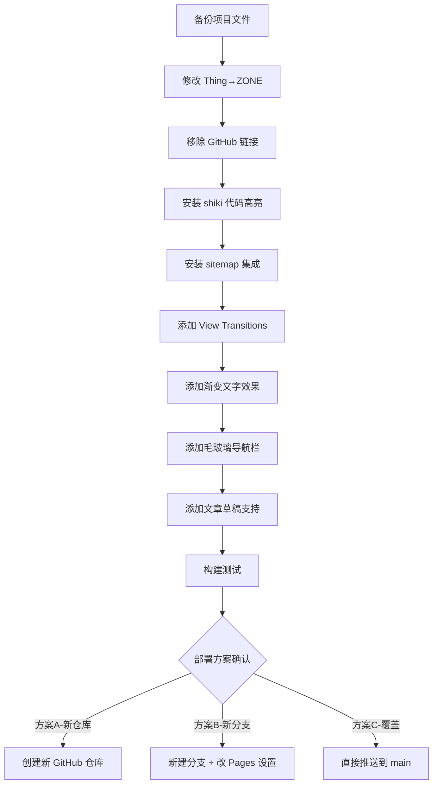

# ZONE 个人网站 — 修改方案 v1

> 创建时间：2026-05-10
> 当前项目路径：D:\Project\WEB

---

## 一、已发现的问题总结

### 1.1 "Thing" → "ZONE" 改名

项目中包含 "Thing" 的文件（需修改）：

| 文件 | 位置 | 当前内容 | 修改为 |
|------|------|---------|-------|
| `src/content/projects/personal-site.md` | 第2行 Frontmatter | `title: Thing 的个人网站` | `title: ZONE 的个人网站` |
| `方案计划.md` | 第4、88、111、130、208行 | 各处 "Thing" 引用 | 改为 "ZONE" |

> 说明：方案计划.md 是搭建时的旧方案文档，里面的 "Thing" 全部改为 "ZONE"

### 1.2 移除 GitHub 链接

| 文件 | 当前内容 | 操作 |
|------|---------|------|
| `src/components/Footer.astro` | 第3行：GitHub 社交链接 | 移除该行 |
| `src/pages/about.astro` | 第41行：GitHub 联系方式 | 移除该行 |
| `src/content/projects/personal-site.md` | 第7行：`github: https://github.com/AKtzone/ZONE` | 移除该字段 |

> 说明：Footer 和 About 页面的 GitHub 个人主页链接、以及作品详情页的 GitHub 按钮一并取消。

### 1.3 部署冲突问题

**当前 GitHub 仓库 `AKtzone/ZONE` 的状态：**
- `main` 分支上已有一个**不同的网站项目**（缅甸语个人作品集）
- 该网站已通过 GitHub Pages 部署在 `https://AKtzone.github.io/ZONE/`
- 部署方式：GitHub Pages 从 `main` 分支根目录直接发布

**风险：** 如果直接推送本项目（Astro 站点）到 `AKtzone/ZONE` 仓库的 `main` 分支，**会完全覆盖**现有的缅甸语网站内容。

**建议方案（3选1）：**

| 方案 | 操作 | 优点 | 缺点 |
|------|------|------|------|
| **方案A（推荐）** | 新建一个 GitHub 仓库（如 `AKtzone/personal-site`），Push 到新仓库并配置 Pages | 新旧网站互不影响 | 访问地址会变成 `https://AKtzone.github.io/personal-site/` |
| **方案B** | 在 `AKtzone/ZONE` 仓库新建一个分支（如 `astro-site`），修改 Pages 设置从该分支部署 | 保持同一个仓库 | 配置较复杂，可能干扰原有项目 |
| **方案C（有风险）** | 直接覆盖 `AKtzone/ZONE` 的 `main` 分支 | 地址不变 | ❌ 会永久删除缅甸语网站 |

---

## 二、第一阶段改进方案（完整实施计划）

### 2.1 代码高亮（shiki）

**改动文件：** `astro.config.mjs`
**说明：** Astro 5.x 内置了 shiki 代码高亮，只需在配置中开启即可。Markdown 中的代码块会自动渲染。

### 2.2 自动生成 Sitemap

**改动文件：** `astro.config.mjs`
**说明：** 安装 `@astrojs/sitemap` 集成，构建时自动根据所有页面生成 sitemap.xml，替代当前手动维护的版本。

### 2.3 页面切换动画（View Transitions）

**改动文件：** `src/layouts/BaseLayout.astro`
**说明：** Astro 5.x 原生支持 View Transitions API，添加后页面切换会有平滑的过渡动画。

### 2.4 渐变文字效果

**改动文件：** `src/styles/global.css`
**说明：** 添加渐变文字 CSS 类和变量，在 Hero 区域的标题使用。

### 2.5 毛玻璃导航栏

**改动文件：** `src/styles/global.css`
**说明：** 导航栏添加 `backdrop-filter: blur()` 实现毛玻璃效果，替代纯色背景。

### 2.6 文章草稿支持

**改动文件：** `src/content/config.ts`
**说明：** 在博客 schema 中添加可选的 `draft` 字段，并修改博客列表页过滤草稿文章。

---

## 三、实施步骤（按顺序执行）



---

## 四、部署说明（方案A - 推荐）

如果选择新建仓库，操作流程：

```bash
# 1. 在 GitHub 创建新仓库 AKtzone/personal-site
# 2. 本地关联新仓库
git init
git add .
git commit -m "初始化 ZONE 个人网站 v1"
git remote add origin git@github.com:AKtzone/personal-site.git
git push -u origin main

# 3. 修改 astro.config.mjs 中的 site 和 base
# site: 'https://AKtzone.github.io'
# base: '/personal-site'

# 4. 提交并推送，让 GitHub Actions 自动部署
```

> ⚠️ **重要提醒：** 推送到新仓库后，访问地址会变成 `https://AKtzone.github.io/personal-site/`
> 如果需要保持 `https://AKtzone.github.io/ZONE/` 这个地址，则必须选择方案C（会覆盖旧项目）

---

## 五、后续阶段规划

| 阶段 | 内容 | 预计时间 |
|------|------|---------|
| ✅ 第一阶段 | 基础改进（本方案实施） | 约30分钟 |
| ⏳ 第二阶段 | 暗色/亮色切换、回到顶部、阅读进度条、标签页 | 半天 |
| ⏳ 第三阶段 | Giscus 评论、RSS、搜索、访问统计 | 按需 |
